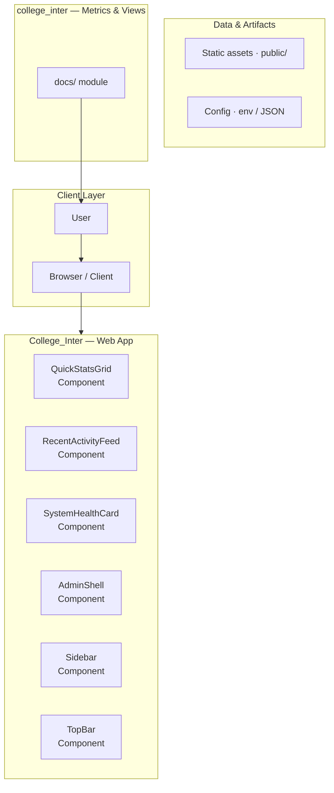
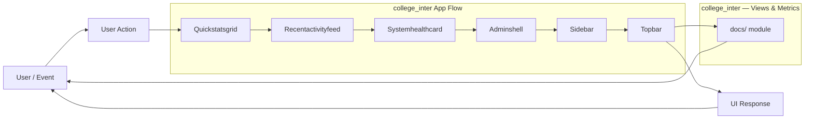
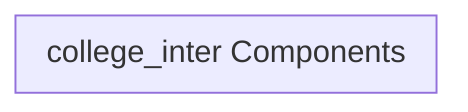
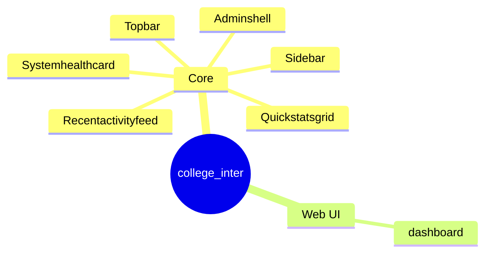

# College Inter - Campus Marketplace and Monitoring Portal

A React-based single-page application designed to serve as a centralized portal for campus commerce, analytics, and order monitoring.

## Overview

The College Inter application is a sophisticated Single Page Application (SPA) built using React and Vite. It functions as a comprehensive dashboard and marketplace, allowing users to view analytics, monitor orders, browse product categories, and manage user interactions. The application relies heavily on state management (Redux Toolkit) and data fetching (React Query) to interact with a backend service, likely Supabase, for persistent data storage and real-time updates.

## Problem

The application needs a structured approach to integrate real-time data monitoring and advanced analytics visualization into the main dashboard view, ensuring that complex data streams (like orders and inventory) are presented to the user in an easily digestible and actionable format.

## Solution

The solution involves enhancing the main Dashboard component by implementing dedicated data fetching hooks and integrating visualization libraries (Recharts) to display key performance indicators (KPIs) and real-time order flow data, thereby transforming raw data into actionable insights for campus stakeholders.

## Key Features

- User Authentication and Authorization (Implied via Supabase/Auth)
- Dashboard Overview: Centralized view for monitoring key metrics.
- Order Monitoring: Tracking of campus orders and transactions.
- Analytics Visualization: Displaying historical and current data trends (e.g., sales over time).
- Product Browsing: Categorized viewing of available goods and services.
- State Management: Utilizing Redux Toolkit for global state handling.

## Technology Stack

- React
- Vite
- JavaScript
- CSS
- Redux Toolkit
- React Query
- Supabase
- Axios
- Recharts

# QuickStats Dashboard Documentation

This repository contains the source code for a comprehensive, feature-rich institutional dashboard designed for college and university management. It provides a centralized view of key performance indicators (KPIs), student enrollment, faculty activity, and operational metrics. The application is built using modern React best practices, ensuring scalability and maintainability.

## 🚀 Overview

**Purpose:** To provide a real-time, actionable dashboard for administrators and stakeholders to monitor the health and performance of the institution.
**Key Features:**
*   **KPI Visualization:** Displays critical metrics (e.g., Total Students, Active Faculty) using dedicated cards.
*   **Data Charting:** Integrates various chart types (line, bar, pie) to visualize trends over time.
*   **Modular Design:** Separates concerns into distinct components and services, making feature additions straightforward.
*   **Role-Based Access:** Implies a structure for managing different user permissions (though specific auth logic is abstracted).

## 🛠️ Technology Stack

*   **Frontend Framework:** React (Functional Components, Hooks)
*   **Build Tool:** Vite
*   **Styling:** Tailwind CSS (Utility-first CSS framework)
*   **State Management:** Context API / Local State (Implied)
*   **Charting:** Dedicated charting library (Implied)

## ⚙️ Development Setup

### Prerequisites

Ensure you have Node.js and npm installed on your system.

### Installation

1.  **Clone the repository:**
    ```bash
    git clone <repository-url>
    cd quickstats-dashboard
    ```
2.  **Install dependencies:**
    ```bash
    npm install
    ```
3.  **Set Environment Variables:**
    Create a `.env` file in the root directory and populate it with necessary API keys or configuration values (e.g., `VITE_API_KEY`).

### Running the Application

| Command | Description | Usage | 
| :--- | :--- | :--- |
| `npm run dev` | Starts the development server with hot module reloading (HMR). | Development | 
| `npm run build` | Builds the optimized production bundle for deployment. | Production | 
| `npm run lint` | Runs ESLint and Prettier checks to enforce code quality. | Quality Check | 

## 🏗️ Architecture and Data Flow

### System Architecture

The application follows a standard component-based architecture, utilizing a clear separation of concerns:

1.  **Data Layer (Services/Hooks):** Handles all external communication (API calls, data fetching). This layer abstracts the data source, ensuring components remain clean and focused on presentation.
2.  **State Management:** Manages the global state of the application (e.g., user data, dashboard metrics). Context API is the primary mechanism for state sharing.
3.  **Component Layer (`src/components`):** Contains reusable UI elements (e.g., `KPI Card`, `Chart Component`, `Sidebar`). These components are dumb/presentational and receive data via props.
4.  **Page Layer (`src/pages`):** Acts as the container. It orchestrates the layout, fetches data using services, and passes the necessary props down to the component layer.

### Data Flow Diagram (Conceptual)

1.  **User Action:** A user navigates to a dashboard page (e.g., `/analytics`).
2.  **Page Component:** The container component mounts and calls a service hook (e.g., `useFetchStudentData`).
3.  **Service Layer:** The service makes an asynchronous API call to the backend.
4.  **Data Received:** The raw data is received and processed (e.g., transformed into chart-ready arrays).
5.  **State Update:** The data is stored in the global state.
6.  **Rendering:** The Page Component re-renders, passing the processed data as props to the relevant presentational components (e.g., `<ChartComponent data={processedData} />`).

## 🧩 Component and Module Breakdown

### Core Reusable Components

These components are designed to be highly reusable across different pages:

*   **`KPI Card`:** Displays a single, critical metric (e.g., Total Students: 12,500). Highly customizable for title, value, and change indicator.
*   **`Chart Component`:** A wrapper around the charting library. Accepts data and chart type (`line`, `bar`, `pie`) as props.
*   **`Sidebar`:** Handles primary navigation and user profile display.
*   **`Table Component`:** Displays structured lists of data (e.g., Faculty List, Course Enrollment).

### Application Pages (Modules)

The dashboard is structured around several key functional modules:

#### 1. Public/Authentication Pages
*   **Login Page:** Handles user authentication and redirects based on role.
*   **Register Page:** (If applicable) Handles new user registration.

#### 2. Core Dashboard Modules
*   **Dashboard Overview (`/`):** The main landing page. Aggregates KPIs and summary charts from all major modules.
*   **Student Management (`/students`):** Focuses on enrollment data, student demographics, and academic progress.
*   **Faculty Management (`/faculty`):** Tracks faculty records, department assignments, and professional development.
*   **Course Management (`/courses`):** Manages course catalog details, prerequisites, and departmental offerings.

#### 3. Analytics & Reporting Modules
*   **Admissions Analytics (`/analytics/admissions`):** Visualizes application trends, conversion rates, and source effectiveness.
*   **Financial Reports (`/analytics/finance`):** (Implied) Tracks revenue streams, tuition payments, and budget allocations.
*   **Activity Log (`/activity`):** Provides a chronological feed of system actions and user interactions for auditing purposes.

## 📚 Development Guidelines

### State Management Best Practices

*   **Avoid Prop Drilling:** Use the React Context API for any state that needs to be accessed by more than two levels of components.
*   **Data Fetching:** All data fetching logic must reside in custom hooks (`use...`) or service files, keeping components purely focused on rendering.

### Styling and Theming

*   **Consistency:** All styling should adhere to the Tailwind CSS utility classes defined in the project's configuration.
*   **Theming:** The application structure supports easy theme switching (e.g., dark mode) by managing a global theme context.

## Setup Guide

### Frontend Setup

```bash

npm install
npm run dev     # development
npm run build && npm start   # production
```

Open `http://127.0.0.1:5173` (or the port shown in the terminal).

### Configuration

Copy environment templates before running:

- `.env.example` → copy to `.env` in the same directory

### Running the Application

1. **Start web app** — `npm run dev` in `./`

```bash
cd .
npm install
npm run dev
```

## System Architecture

High-level system design, data flows, API map, and workflow pipelines derived from the repository structure.

### System Architecture



### Data Flow & Charts Pipeline



### Component & API Map



### Application Page Map



## Application Pages

Screenshots captured from the running application. Each page is listed with its function.

### Application

#### Analytics

Analytics — application page at `/analytics`


#### Categories

Categories — application page at `/categories`


#### Dashboard

Dashboard — application page at `/dashboard`


#### Forgot Password

Forgot Password — application page at `/forgot-password`


#### Locations

Locations — application page at `/locations`


### Public

#### Login

Login — application page at `/login`


### Application

#### Orders

Orders — application page at `/orders`


#### Reset Password

Reset Password — application page at `/reset-password`


#### Shops

Shops — application page at `/shops`


