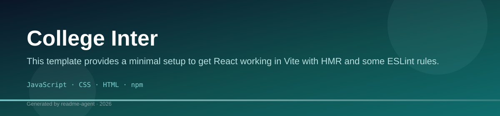
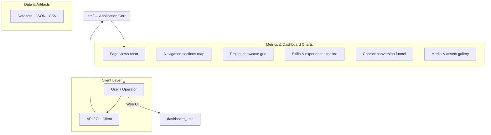
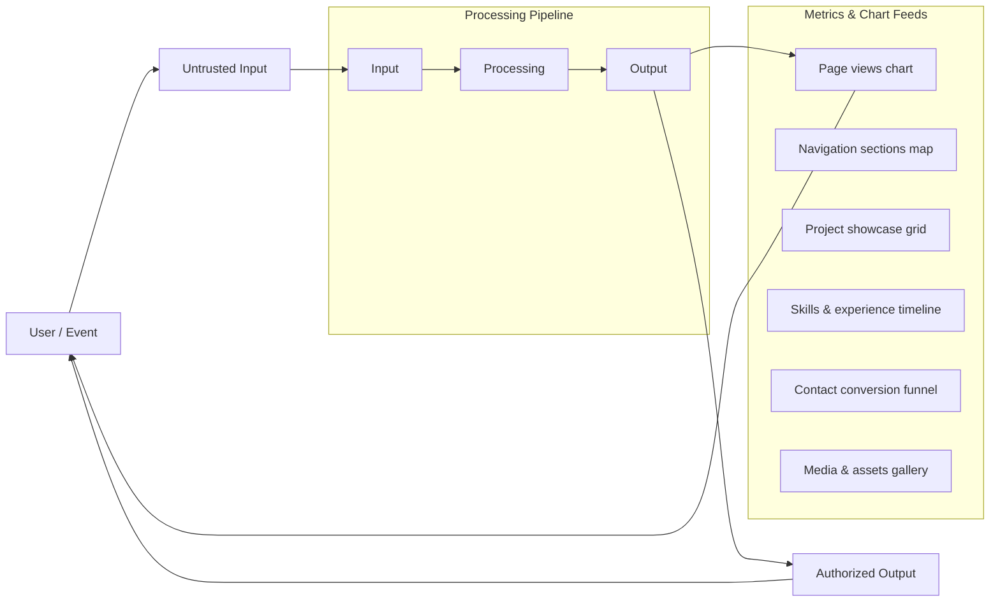
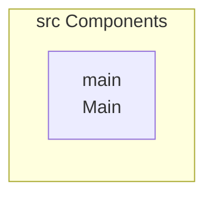
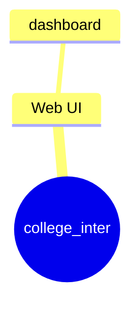
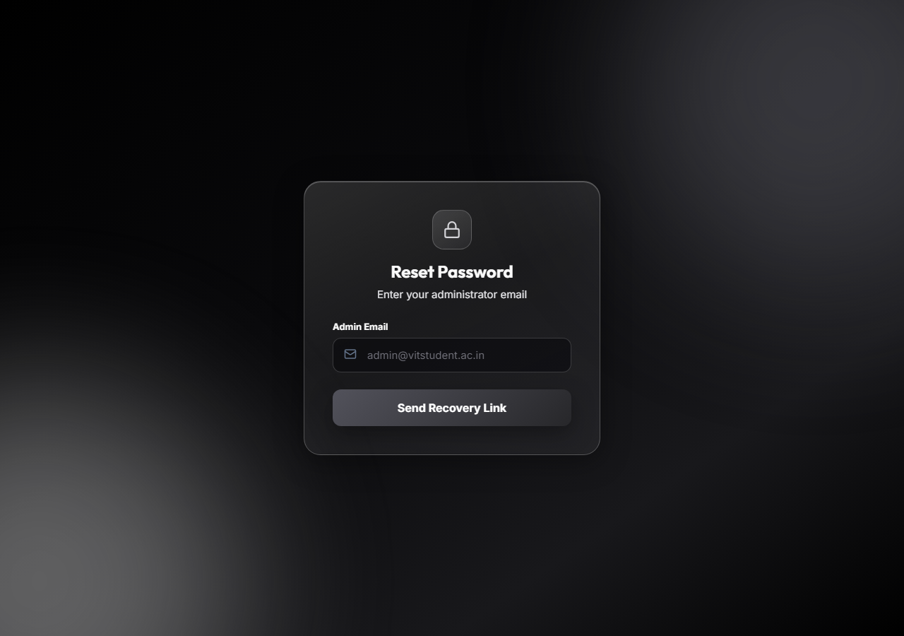
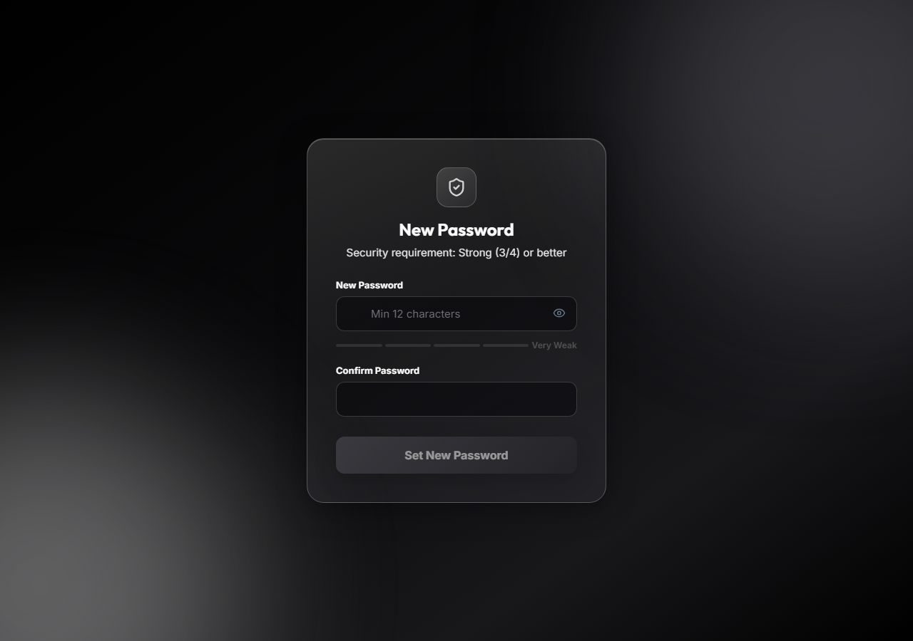
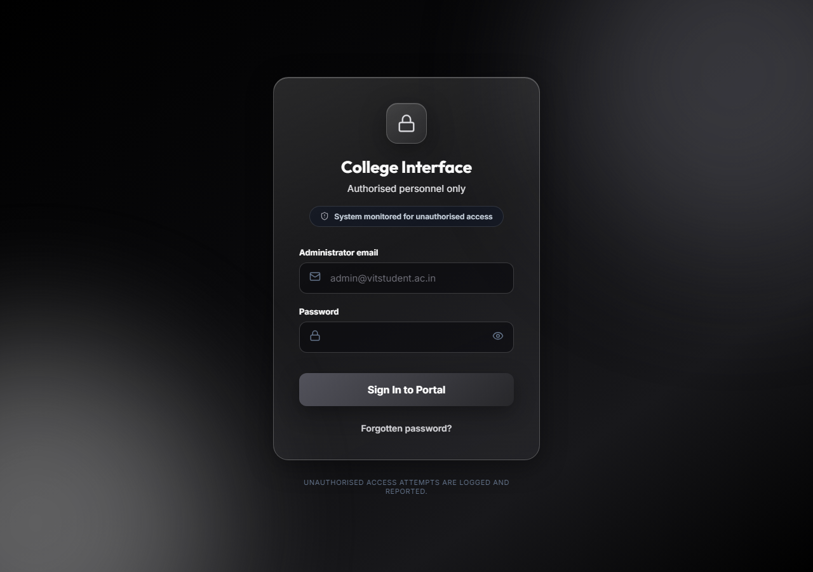

# College Inter

This template provides a minimal setup to get React working in Vite with HMR and some ESLint rules.

## Technology Stack

- JavaScript
- CSS
- HTML
- npm

## College Inter

This template provides a minimal setup to get React working in Vite with HMR and some ESLint rules.

This project appears to be a comprehensive web application, featuring modules for authentication, session management, and real-time monitoring.

## 🚀 Getting Started

### Prerequisites

Ensure you have Node.js and npm installed.

### Installation

Clone the repository and install dependencies:

```bash
npm install
```

## 💻 Usage

This project includes several scripts defined in `package.json` for development, building, linting, and previewing.

### Development Server

Starts the development server with Hot Module Replacement (HMR):

```bash
npm run dev
```

### Build Project

Generates the production build of the application:

```bash
npm run build
```

### Lint Code

Runs ESLint to check for code quality and style issues:

```bash
npm run lint
```

### Preview Build

Serves the built application locally for testing:

```bash
npm run preview
```

## ✨ Features and Architecture

Based on the project structure, the application includes several key functional areas:

*   **Authentication:** Dedicated components and context (`src/auth/`) for handling login, registration, password reset, and protected routes.
*   **State Management & Hooks:** Custom hooks are available for complex logic, such as `useAdminAuth`, `useCampusOrderMonitor`, and `useShopStatusWatcher`, suggesting monitoring and role-based access control.
*   **Core Setup:** Built using React and Vite, providing a modern, fast development environment.

## 📂 Project Structure

The repository is organized as follows:

**Root Directory:**
*   `.env`: Environment variables file.
*   `.env.example`: Example environment variables.
*   `.gitignore`: Specifies files/directories to ignore.
*   `README.md`: This file.
*   `eslint.config.js`: ESLint configuration file.
*   `index.html`: Main HTML entry point.
*   `package-lock.json`: Lock file for package dependencies.
*   `package.json`: Project metadata and scripts.
*   `vite.config.js`: Vite configuration file.

**`public/` Directory:**
*   `public/favicon.svg`: Favicon asset.
*   `public/icons.svg`: Icon asset.

**`src/` Directory:**
*   `src/App.css`: Global styles for the main component.
*   `src/App.jsx`: Main application component.
*   `src/assets/`: Contains various assets (e.g., `hero.png`, `react.svg`, `vite.svg`).
*   `src/auth/`: Contains authentication-related components (e.g., `Login.jsx`, `ForgotPassword.jsx`, `ProtectedRoute.jsx`).
*   `src/hooks/`: Contains custom reusable hooks (e.g., `useAdminAuth.js`, `useCampusOrderMonitor.js`).
*   ... and 23 more files.

## 🛠️ Tech Stack

*   JavaScript
*   CSS
*   HTML
*   npm

## Setup Guide

### Frontend Setup

```bash

npm install
npm run dev     # development
npm run build && npm start   # production
```

Open `http://127.0.0.1:5173` (or the port shown in the terminal).

### Configuration

Copy environment templates before running:

- `.env.example` → copy to `.env` in the same directory

### Running the Application

1. **Start web app** — `npm run dev` in `./`

```bash
cd .
npm install
npm run dev
```

## System Architecture

High-level system design, data flows, API map, and workflow pipelines derived from the repository structure.

### System Architecture



### Data Flow & Charts Pipeline



### Component & API Map



### Application Page Map



## Application Pages

Screenshots captured from the running application. Each page is listed with its function.

### Application

#### Analytics

Analytics — application page at `/analytics`


#### Categories

Categories — application page at `/categories`


#### Dashboard

Dashboard — application page at `/dashboard`


#### Forgot Password

Forgot Password — application page at `/forgot-password`



### Public

#### Login

Login — application page at `/login`


### Application

#### Orders

Orders — application page at `/orders`


#### Reset Password

Reset Password — application page at `/reset-password`



#### Shops

Shops — application page at `/shops`


